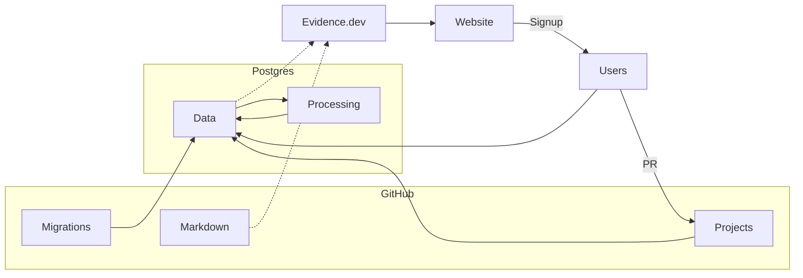

# FOSS.NG OSS LEADERBOARD

## Overview

We are building a leaderboard for open-source contributions of UC students. The primary goal is to encourage students to make open-source contributions, improving their github profile, and developing software collaboration skills.

## Key Features

1. **Sign-up:** A student can sign up using their Github Account and UC email
1. **Scoring and Ranking:** Periodically, the program scrapes their OSS contributions, and scores and ranks them
1. **Leaderboard:** Everyone can view the leaderboard with top contributors and their contributions
1. **User Profile:** A page with detailed information on each contributor, the projects they contributed to, proficient languages, interests etc.

## Other considerations

1. **Scoring Algorithm:** The score assigned to each contribution should be factor in the popularity, usefulness of the project. It should use indicators like stars, fork, # of contributors, age of commit, issues, PR reviews etc.

## Technical specifications

1. **Database:** Postgres via [Tembo](https://tembo.io/).
1. **UI:** Evidence.dev
1. **Domain:** TBD
1. **Hosting:** Evidence Cloud

### Architecture

## Schema Overview

- Users: These will be the UC students and contributors we will be tracking. Stores information like their email, github username, major, year, score
- Projects: Projects that students contributed to. This should be automatically scraped. It stores information like stars, contributors, forks etc
- Contributions: Links the users to project commits
- Leaderboard history: Optional

## Future Enhancements

1. Expand to other universities
1. Screener for employers to find the student who is the right fit for the role
1. Track contributions across other VCS, research publications etc.
